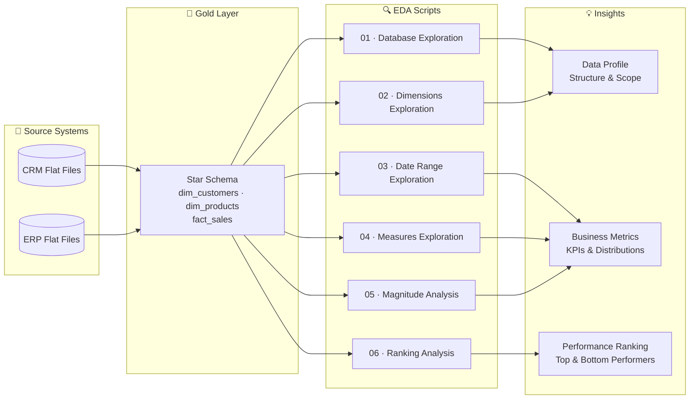

# 🛒  SQL Sales Data — Exploratory Data Analysis


-gold)


A comprehensive SQL EDA project systematically profiling a multi-table sales dataset — from schema inspection to ranking analysis — to deliver a business performance overview and strategic insights.

## 📑 Table of Contents

- [Overview](#-overview)
- [Data Architecture](#%EF%B8%8F-data-architecture)
- [Project Components](#-project-components)
- [Analysis Breakdown](#-analysis-breakdown)
- [Technical Skills Demonstrated](#%EF%B8%8F-technical-skills-demonstrated)
- [Repository Structure](#-repository-structure)
- [Tech Stack](#%EF%B8%8F-tech-stack)
- [Key Business Questions Answered](#-key-business-questions-answered)
- [License](#-license)

## 📖 Overview

This repository contains a structured **Exploratory Data Analysis (EDA)** performed entirely in T-SQL on a star-schema sales database. It queries the **Gold layer** of a medallion architecture — clean, integrated data made up of one fact table and two dimension tables — to answer key business questions across sales performance, customer demographics, and product distribution.

## 🏗️ Data Architecture

The analysis operates on the **Gold layer** of a Medallion architecture — the business-ready, integrated output of an upstream ETL pipeline:



| Table | Rows | Description |
|---|---|---|
| `gold.fact_sales` | ~60,400 | Order-level transactions with sales amount, quantity, and price |
| `gold.dim_customers` | ~18,400 | Customer profiles including country, gender, and birthdate |
| `gold.dim_products` | ~297 | Product catalog with category, subcategory, and cost |

## 🧱 Project Components

| Component | Description |
|---|---|
| **Database Exploration** | Schema & metadata inspection via `INFORMATION_SCHEMA` |
| **Dimensions Exploration** | Unique value profiling across categorical columns |
| **Date Range Exploration** | Temporal boundaries and customer age analysis |
| **Measures Exploration** | Core KPI aggregations and a consolidated business metrics report |
| **Magnitude Analysis** | Grouped revenue and quantity distributions across countries, categories, and gender |
| **Ranking Analysis** | Top/bottom performer identification using `TOP N` and window functions |

## 🔍 Analysis Breakdown

### 1. Database Exploration (`01_database_exploration.sql`)
Queried `INFORMATION_SCHEMA` to map out all tables, column names, data types, nullability, and character limits — establishing a clear understanding of the data model before any analysis.

### 2. Dimensions Exploration (`02_dimensions_exploration.sql`)
Used `DISTINCT` and `ORDER BY` to profile the categorical landscape:
- Customer countries of origin
- Full product taxonomy (category → subcategory → product name)

### 3. Date Range Exploration (`03_date_range_exploration.sql`)
Determined temporal scope using `MIN()`, `MAX()`, and `DATEDIFF()`:
- First and last order dates, and the total span in months
- Oldest and youngest customer ages derived from birthdates

### 4. Measures Exploration (`04_measures_exploration.sql`)
Computed all core business KPIs using aggregate functions, including a consolidated UNION-based metrics report:

| KPI | Function Used |
|---|---|
| Total Sales Revenue | `SUM(sales_amount)` |
| Total Quantity Sold | `SUM(quantity)` |
| Average Selling Price | `AVG(price)` |
| Total Unique Orders | `COUNT(DISTINCT order_number)` |
| Total Products | `COUNT(DISTINCT product_name)` |
| Total Customers | `COUNT(customer_key)` |

### 5. Magnitude Analysis (`05_magnitude_analysis.sql`)
Grouped and compared data across key business dimensions using `GROUP BY` with multi-table `LEFT JOIN`s:
- Customer counts by **country** and **gender**
- Product counts and average costs by **category**
- Total revenue by **category**, **customer**, and **country**
- Units sold distribution across regions
- Cross-dimensional analysis: revenue by **category × gender** and **category × country**

### 6. Ranking Analysis (`06_ranking_analysis.sql`)
Identified top and bottom performers using both simple `TOP N` filtering and advanced **window functions**:
- Top 5 revenue-generating products (with `RANK() OVER`)
- Bottom 5 worst-performing products
- Top 10 highest-value customers
- 5 customers with the fewest orders placed

---

## 🛠️ Technical Skills Demonstrated

- **Schema introspection** via `INFORMATION_SCHEMA`
- **Aggregate functions**: `SUM`, `COUNT`, `AVG`, `MIN`, `MAX`
- **Date functions**: `DATEDIFF`, `GETDATE`
- **Window functions**: `RANK()`, `DENSE_RANK()`, `ROW_NUMBER()` with `OVER()`
- **Multi-table joins**: `LEFT JOIN` across fact and dimension tables
- **Set operations**: `UNION ALL` for consolidated reporting
- **Filtering & sorting**: `WHERE`, `GROUP BY`, `ORDER BY`, `TOP`
- **Deduplication**: `DISTINCT` for clean categorical profiling

---

## 📂 Repository Structure

```
sales-eda-project/
│
├── datasets/                               # Raw source data (CSV flat files)
│   ├── dim_customers.csv                   # Customer dimension table
│   ├── dim_products.csv                    # Product dimension table
│   └── fact_sales.csv                      # Sales fact table
│
├── scripts/                                # SQL analysis scripts (run in order)
│   ├── 01_database_exploration.sql         # Schema & metadata inspection
│   ├── 02_dimensions_exploration.sql       # Unique value profiling
│   ├── 03_date_range_exploration.sql       # Temporal boundary analysis
│   ├── 04_measures_exploration.sql         # Core KPI aggregations
│   ├── 05_magnitude_analysis.sql           # Grouped distribution analysis
│   └── 06_ranking_analysis.sql             # Top/bottom performer ranking
│
├── README.md                               # Project overview and instructions
└── LICENSE                                 # License information for the repository
```

---

## 🛠️ Tech Stack

- **Database**: Microsoft SQL Server (Express edition is sufficient)
- **Language**: T-SQL — aggregate functions, window functions, joins, set operations
- **Tooling**: SQL Server Management Studio (SSMS)
- **Diagrams**: ***Mermaid*** (renders natively in this README)
- **Version control**: Git / GitHub

## 💡 Key Business Questions Answered

- What is the total revenue, order volume, quantity sold, and average selling price?
- Which product **categories** generate the most revenue?
- Which **countries** have the most customers and highest units sold?
- How is revenue distributed by **gender** and **geography**?
- Who are the **top 10 highest-value customers** and the **least engaged** customers?
- What are the **top 5 best-selling** and **bottom 5 worst-performing** products?
- What is the **age range** of the customer base?
- What is the **full temporal span** of the order history?

## 📜 License

This project is licensed under the [MIT License](LICENSE) — feel free to use, modify, and share with attribution.
